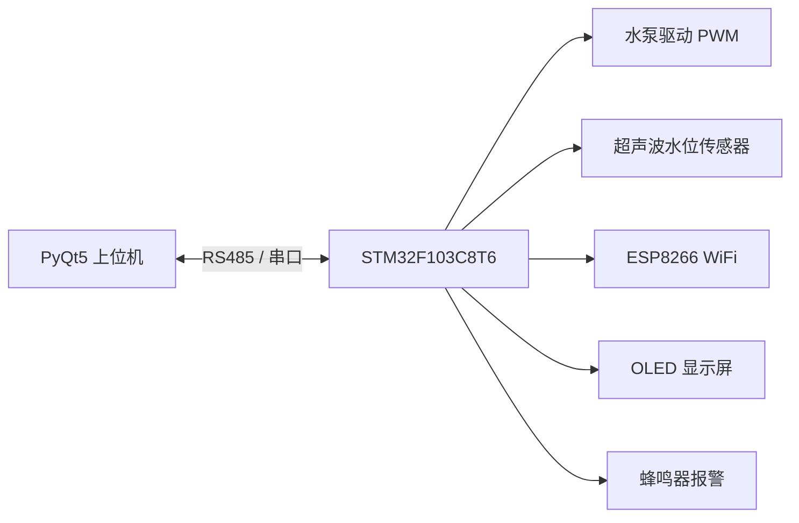
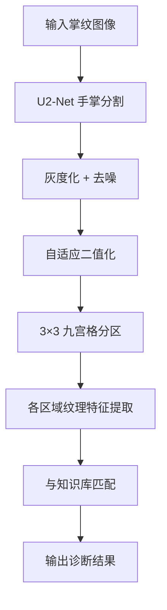
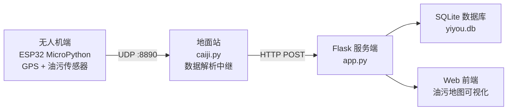

## 项目总览

本文档汇总了 2026 年哈工大三位本科毕业生的课题项目，旨在为后续交接、复现和维护提供清晰的技术参考。

| 序号 | 项目名称 | 核心方向 | 技术栈 | Python |
|:---:|------|------|------|:---:|
| 1 | 智能水泵控制系统 | 嵌入式 + 上位机 | STM32 (Keil) + PyQt5 | 3.11 |
| 2 | 掌纹诊断系统 | 计算机视觉 + 中医 | U2-Net + OpenCV + Tkinter | 3.12 |
| 3 | 无人机溢油监测系统 | 物联网 + Web | Flask + MicroPython + SQLite | 3.14 |

所有项目源码位于 `D:\Python\` 目录下。

---

## 一、智能水泵控制系统

**目录**：`D:\Python\20260526_pump_control\`

### 1.1 项目简介

基于 STM32F103C8T6 的智能水泵控制系统，通过 RS485 总线实现上下位机通信。上位机使用 PyQt5 提供图形化控制界面，支持自动/手动抽水、排水、水位监测与报警功能。

### 1.2 系统架构



### 1.3 STM32 工程结构（Keil MDK）

工程文件位于 `STM32/project/Base_obj.uvprojx`，使用 Keil MDK 打开。

#### 目录结构

```
STM32/
├── project/                  # Keil 工程文件
│   ├── Base_obj.uvprojx      # 主工程（双击打开）
│   └── Base_obj_1.uvprojx    # 备用工程（另一个版本）
├── user/                     # 用户代码（核心）
├── libraries/                # STM32 标准外设库
│   ├── CMSIS/                # Cortex-M3 内核支持
│   ├── inc/                  # 库头文件
│   └── src/                  # 库源文件
└── cube_migration/           # CubeMX 迁移中间文件（可忽略）
```

#### 核心源文件清单（`user/` 目录）

| 文件 | 功能 | 备注 |
|------|------|------|
| `main.c` | 主程序入口，系统状态机（0~5 状态） | **核心文件** |
| `rs485.c/h` | RS485 通信协议，上下位机指令交互 | **通信核心** |
| `pwm.c/h` | PWM 水泵转速控制 | 驱动层 |
| `csb.c/h` / `csb_uart.c/h` | 超声波传感器测水位 | 传感器 |
| `esp8266.c/h` | ESP8266 WiFi 模块（预留） | 无线通信 |
| `oled.c/h` | OLED 屏显示（水位、状态） | 本地显示 |
| `baojing.c/h` | 蜂鸣器报警逻辑 | 异常报警 |
| `timer.c/h` | 定时器（心跳、超时） | 时序管理 |
| `key_click1~4.c/h` | 物理按键处理 | 本地操作 |
| `jiashui_time.c/h` | 加水定时管理 | 进水控制 |
| `jm_show.c/h` | 界面显示逻辑 | OLED 界面 |
| `spi_ying.c/h` | SPI Flash 存储 | 数据存储 |
| `usart1.c/h` | 串口1 驱动 | 调试/通信 |
| `delay.c/h` | 微秒/毫秒延时 | 基础工具 |
| `my_gpio.c/h` | GPIO 初始化统一管理 | 硬件抽象 |
| `my_h.c/h` | 全局宏定义和头文件 | 工程配置 |

> **注意**：`*_1.c/h` 文件为第二版替代实现，当前工程使用不带 `_1` 后缀的版本。

#### 系统状态机（`main.c` 定义）

| 状态值 | 含义 |
|:---:|------|
| 0 | 待机 standby |
| 1 | 进水泵运行 intake pump running |
| 2 | 等待排水触发 waiting for drainage trigger |
| 3 | 自动排水 automatic drainage |
| 4 | 手动排水 manual drainage |
| 5 | 报警（预留） |

### 1.4 上位机（Python）

**Python 环境**：conda `pump_control`（Python 3.11）

**启动命令**：
```powershell
conda activate pump_control
cd D:\Python\20260526_pump_control
python bisheswj.py
```

**功能模块**：
- 串口选择（自动扫描可用端口，默认 115200bps）
- 启动抽水 / 停止抽水 / 手动排水
- 目标水位设定（± 微调按钮）
- 实时水位显示、系统状态指示灯
- 运行日志面板

**依赖**：

| 包 | 用途 |
|------|------|
| PyQt5 | GUI 界面框架 |
| pyserial | 串口通信 |

安装方法：
```powershell
pip install PyQt5 pyserial
```

### 1.5 硬件接线参考

| STM32 引脚 | 外设 |
|------|------|
| USART1 (PA9/PA10) | RS485 模块（接上位机） |
| 定时器 CH 输出 | 水泵 PWM 驱动 |
| GPIO | 超声波 Trig/Echo |
| I2C (PB6/PB7) | OLED 显示屏 |
| USART2 | ESP8266 WiFi |
| GPIO | 按键 ×4、蜂鸣器 |

### 1.6 部署要点

1. 用 **Keil MDK v5** 打开 `STM32/project/Base_obj.uvprojx`
2. 通过 ST-Link / J-Link 烧录至 STM32F103C8T6
3. 上位机端安装 PyQt5 + pyserial
4. USB 转 RS485 连接电脑，打开对应串口
5. 确认波特率 **115200** 与固件一致

---

## 二、掌纹诊断系统

**目录**：`D:\Python\20260603_palm_diagnosis\`

### 2.1 项目简介

基于计算机视觉的中医掌纹诊断系统。对手掌图像进行九宫格分区，提取各区域的纹理特征（米字纹、十字纹、三角纹等），结合中医掌诊知识库给出健康提示。使用 U2-Net 做手掌分割，OpenCV 做纹理分析。

### 2.2 系统流程



### 2.3 文件结构

```
20260603_palm_diagnosis/
├── palm_diagnosis.py         # 主程序（Tkinter GUI，最新版）
├── palm_diagnosis0521.py     # 5/21 版本（备选）
├── palm_diagnosis0522.py     # 5/22 版本（备选）
├── sketch_style.py           # 素描风格处理
├── u2_net/                   # U2-Net 人像分割模型
│   ├── saved_models/
│   │   ├── u2net.pth         # 预训练权重（~176MB）
│   │   └── face_detection_cv2/
│   ├── model/                # U2-Net 模型定义
│   ├── u2net_test.py         # 模型测试
│   └── u2net_train.py        # 训练脚本
├── database of palmprints/   # 掌纹知识库/样本库
├── requirements.txt          # Python 依赖
└── readme.md                 # 详细算法说明
```

### 2.4 核心算法路径

#### ① 图像预处理
```python
gray   = cv2.cvtColor(img, cv2.COLOR_BGR2GRAY)
blur   = cv2.GaussianBlur(gray, (5,5), 0)
thresh = cv2.adaptiveThreshold(blur, 255, ADAPTIVE_THRESH_GAUSSIAN,
                               THRESH_BINARY_INV, 11, 2)
```

#### ② 九宫格分区
- 将预处理后的图像均匀划分为 3×3 = 9 个区域
- 对应八卦方位：**巽、离、坎、兑、乾、坤、艮、震 + 中宫（明堂）**

#### ③ 纹理特征提取
- Canny 边缘检测 → `cv2.findContours` 提取轮廓
- 轮廓形状匹配：`cv2.matchShapes()` 与标准模板比对
- 辅以 Gabor 滤波（`skimage.filters.gabor_kernel`）分析脊线走向
- 识别类型：米字纹、十字纹、三角纹、岛纹、环形纹、星形纹等

#### ④ 知识库匹配
- 将每个区域的识别结果与掌纹医学知识库对应
- 例如：巽区出现米字纹 → 提示胆结石倾向

### 2.5 依赖与环境

U2-Net 需要 PyTorch，`requirements.txt` 主要内容（UTF-16 编码）：

| 包 | 用途 |
|------|------|
| torch / torchvision | U2-Net 深度学习推理 |
| opencv-python | 图像处理全流程 |
| numpy | 矩阵运算 |
| scipy | 图像旋转、多区域分析 |
| scikit-image | Gabor 滤波 |
| Pillow | Tkinter 图像显示 |
| tkinter | GUI（Python 自带） |

**Python 环境**：conda `20260603_palm_diagnosis`（Python 3.12）

安装命令（环境已创建，只需安装依赖）：
```powershell
conda activate 20260603_palm_diagnosis
pip install torch torchvision --index-url https://download.pytorch.org/whl/cpu
pip install opencv-python numpy scipy scikit-image Pillow
```

> ⚠️ `requirements.txt` 为 Windows UTF-16 编码，pip 可能无法直接解析，建议按上表手动安装。

### 2.6 启动方式

```powershell
conda activate 20260603_palm_diagnosis
cd D:\Python\20260603_palm_diagnosis
python palm_diagnosis.py
```

GUI 提供：加载图片 → 自动分割 → 九宫格标注 → 各区域诊断结果显示。

### 2.7 部署要点

1. U2-Net 权重文件 `u2_net/saved_models/u2net.pth` 约 176MB，部署时确保带上
2. 首次运行需要下载 PyTorch，建议使用 CPU 版本（兼容性最好）
3. 知识库位于 `database of palmprints/`，可自行扩充样本
4. 三个 `palm_diagnosis*.py` 为迭代版本，`palm_diagnosis.py` 为最新

---

## 三、无人机溢油实时监测系统

**目录**：`D:\Python\260515_GPS\`

### 3.1 项目简介

无人机搭载油污传感器与 GPS 模块，通过 WiFi 实时回传溢油检测数据。地面站运行 Flask Web 服务，提供数据接收、存储、可视化展示。硬件端使用 MicroPython 设备（ESP32），通过 UDP 协议与地面站通信。

### 3.2 系统架构



### 3.3 文件结构

```
260515_GPS/
├── app.py              # Flask Web 服务（主要后台）
├── caiji.py            # 数据采集中继（UDP → HTTP）
├── ran.bat             # 一键启动脚本
├── requirements.txt    # Python 依赖（UTF-16 编码）
├── templates/
│   └── index.html      # Web 前端页面
├── instance/
│   └── yiyou.db        # SQLite 数据库（自动生成）
└── 项目要求.md          # 硬件端配置说明
```

### 3.4 关键代码解析

#### 硬件端配置（MicroPython）

根据 `项目要求.md`，硬件端（ESP32）需通过 **Thonny IDE** 配置：

1. 安装 CP210x USB 串口驱动
2. Thonny 右下角配置解释器为 MicroPython 设备
3. 打开设备上的 `main.py`，修改以下配置：

```python
WIFI_SSID = "654321"
WIFI_PASSWORD = "123456789"
PC_IP = "192.168.2.188"   # 通过 ipconfig 查询，需与 PC 同网段
UNIFIED_PORT = 8890        # 固定不变
```

> ⚠️ 硬件和 PC 必须处于同一 2.4GHz WiFi 网络下。

#### 数据流（`caiji.py`）

| 数据来源 | 帧头识别 | 解析内容 |
|------|------|------|
| GPS NMEA | `$GPGGA / $GPRMC` | 经纬度（pynmea2 解析） |
| 油污传感器 | `0x22 0x04` | 油污报警、轻油浓度、重油浓度、温度、距离 |

`caiji.py` 同时监听 UDP 8890 端口，收到数据后通过 HTTP POST 发送至 Flask 后端。

#### Web 服务（`app.py`）

- **SQLite 模型**：`YIYOU` 表，字段包括 `drone_id`、经纬度、油污数据、温度、距离
- **API 接口**：
  - `POST /api/upload_data` — 接收数据
  - `GET /api/get_data` — 查询最近 20 条记录
- **前端**：`templates/index.html` 提供地图可视化

### 3.5 依赖

`requirements.txt`（UTF-16 编码，主要内容）：

| 包 | 用途 |
|------|------|
| Flask | Web 框架 |
| Flask-SQLAlchemy | ORM 数据库操作 |
| pynmea2 | GPS NMEA 语句解析 |
| altgraph | 打包依赖（PyInstaller） |

**Python 环境**：系统 Python 3.14（无独立 conda 环境）

安装命令：
```powershell
C:\Users\1\AppData\Local\Programs\Python\Python314\python.exe -m pip install Flask Flask-SQLAlchemy pynmea2
```

### 3.6 启动步骤

#### 方式一：一键启动
```powershell
cd D:\Python\260515_GPS
ran.bat
```

#### 方式二：手动启动
```powershell
# 终端1：启动 Web 服务
cd D:\Python\260515_GPS
python app.py
# → 访问 http://127.0.0.1:5000

# 终端2：启动数据采集中继
python caiji.py
```

### 3.7 部署要点

1. 确保 PC 连接 2.4GHz WiFi，IP 地址与 ESP32 配置一致
2. 先启动 `app.py`，再启动 `caiji.py`
3. `yiyou.db` 会在 `instance/` 下自动生成，无需手动创建
4. 硬件端使用 **Thonny** 烧录和调试 MicroPython 代码
5. ESP32 设备名 `DJI-M300`（`caiji.py` 中硬编码），如需修改请同步更改

---

## 附录：环境速查

| 项目 | conda 环境 | Python | 关键注意 |
|------|------|:---:|------|
| 水泵控制 | `pump_control` | 3.11 | 需 Keil MDK + ST-Link |
| 掌纹诊断 | `20260603_palm_diagnosis` | 3.12 | U2-Net 权重 176MB，使用 CPU 版 PyTorch |
| 溢油监测 | 系统 Python | 3.14 | 需 2.4GHz WiFi + MicroPython 设备 |

---

*本文档随项目迭代持续更新，如有疑问请联系 王前。* 🔧
