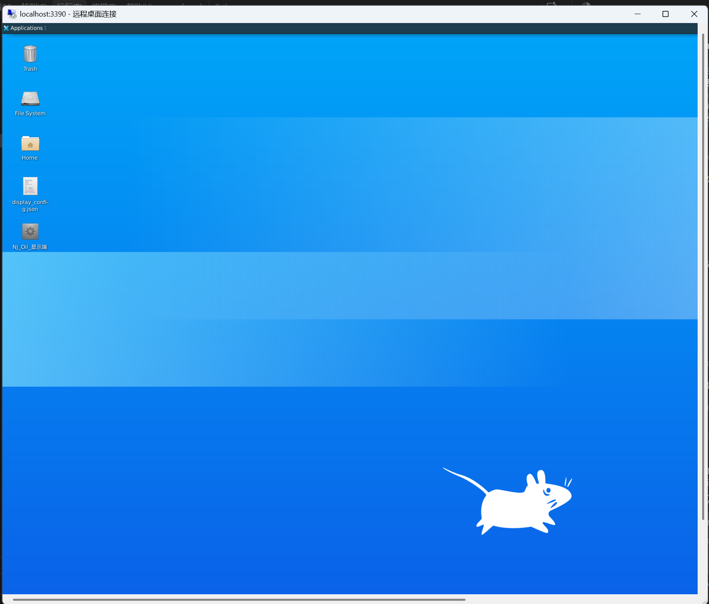

## 背景：为什么需要 Linux GUI

我在 Windows 上用 PyInstaller 打包了一个 Python Web 应用（`NJ_Oil_显示端`），目标平台是**银河麒麟 V10**（glibc 2.28）。为了保证 glibc 兼容性，需要用 glibc ≤ 2.31 的 Linux 环境打包。

但光打包不够——**我必须在 Linux 上实际运行这个 GUI 程序，看看它能不能正常启动、浏览器能不能弹出、页面能不能渲染**。

WSLg 只能显示单个 GUI 窗口，不支持完整桌面环境。而我需要的是一个**完整的 Linux 桌面**，可以像虚拟机一样操作。

> 需求链条：打包 for Kylin → 必须在 Linux 上测试 → 必须看到完整 GUI → WSLg 不够 → **xrdp 远程桌面**

## 技术选型对比

| 方案 | 优点 | 缺点 | 结论 |
|------|------|------|------|
| Docker | 隔离干净、可复现、CI/CD 友好 | Docker Desktop on Windows **底层就是 WSL2**（[官方架构](https://docs.docker.com/desktop/features/linux/)），所以"不用 WSL 直接用 Docker"是伪命题——你并没有绕开 WSL2，只是多套了一层。对 GUI 桌面场景：容器无 systemd → 手动管理 dbus/xrdp 生命周期；无持久会话 → 每次重建容器桌面配置丢失；需要额外装 VNC + 窗口管理器 → 跟 WSL2 方案一样复杂但多一层隔离开销。Docker 更适合**无头打包/CI**，不适合**交互式 GUI 测试** | ❌ 本场景不适用 |
| WSL2 直接导入 | 轻量、快速、与 Windows 文件系统互通 | 需手动装 xrdp | ✅ 采用 |
| Hyper-V 虚拟机 | 完整 GUI | 重量级、占资源多 | 备选 |
| WSLg | 开箱即用 | **只支持单窗口，不支持完整桌面**（[Microsoft 官方文档](https://learn.microsoft.com/en-us/windows/wsl/tutorials/gui-apps)确认） | ❌ 不够 |

## 环境信息

- **Windows 11** Build 26200, Intel Core Ultra 5 125H, 32GB RAM
- **WSL 2** v2.7.14.0
- **Ubuntu 20.04** (cloud image, glibc 2.31, Python 3.8.10)
- **xrdp** 0.9.12 + **TigerVNC** 1.10.1 + **Xfce4**

## 搭建步骤

### 1. 导入 Ubuntu 20.04 WSL

> ⚠️ 不要用 Ubuntu 18.04！Python 3.6 缺少 `ThreadingHTTPServer`，PyInstaller 打包会失败。

```powershell
# 下载 cloud image
curl -LO https://cloud-images.ubuntu.com/releases/20.04/release/ubuntu-20.04-server-cloudimg-amd64-root.tar.xz

# 导入 WSL
wsl --import Ubuntu2004 D:\WSL\Ubuntu2004 ubuntu-20.04-server-cloudimg-amd64-root.tar.xz

# 设为默认
wsl --set-default Ubuntu2004
```

### 2. 安装 xrdp + Xvnc + Xfce4

```bash
# 换源（国内）
sed -i 's|http://archive.ubuntu.com|https://mirrors.aliyun.com|g' /etc/apt/sources.list
sed -i 's|http://security.ubuntu.com|https://mirrors.aliyun.com|g' /etc/apt/sources.list
apt update

# 安装桌面和远程桌面
apt install -y xfce4 xfce4-goodies xrdp tigervnc-standalone-server xorgxrdp
```

### 3. 配置 xrdp

```bash
# 改端口避免与 Windows RDP 冲突
sed -i 's/port=3389/port=3390/' /etc/xrdp/xrdp.ini

# 确保 X11DisplayOffset=10（避免跟 WSLg 的 :0 冲突）
# /etc/xrdp/sesman.ini 中确认：
# X11DisplayOffset=10
```

### 4. 编写持久启动脚本

WSL 在没有进程运行时会自动关闭，导致 xrdp 断连。需要一个 `sleep infinity` 保活：

```bash
cat > /usr/local/bin/start-desktop.sh << 'EOF'
#!/bin/sh
service dbus start
service xrdp-sesman start
service xrdp start
exec sleep infinity
EOF
chmod +x /usr/local/bin/start-desktop.sh
```

Windows 端用 async 模式启动：

```powershell
wsl -d Ubuntu2004 -- /usr/local/bin/start-desktop.sh
```

### 5. 连接

```powershell
mstsc /v:localhost:3390
```

登录界面：session 选 **Xvnc**，username 填 `root`，password 填你设置的密码。

## 踩坑全记录

### 坑 1：`.xsession` 配置错误 —— `unset DISPLAY` 杀死会话

**现象**：xrdp 登录后闪退，日志显示 `login failed for display 0`

**原因**：`/root/.xsession` 文件中包含了 `unset DISPLAY`，而 xrdp 启动会话时会通过 `DISPLAY` 环境变量告诉窗口管理器连哪个 X server。`unset DISPLAY` 直接把这个变量删了，xfce4 找不到 X server，会话立即退出。

**修复**：

```bash
echo '#!/bin/sh' > /root/.xsession
echo 'exec startxfce4' >> /root/.xsession
chmod +x /root/.xsession
```

> 参考：[xrdp wiki - Troubleshooting](https://github.com/neutrinolabs/xrdp/wiki/Troubleshooting)

### 坑 2：Xorg 后端在 WSL2 中无法启动

**现象**：选 Xorg session 登录失败

**原因**：WSL2 没有真正的 GPU 驱动，Xorg 需要 DRM/KMS 支持，WSL2 提供不了。即使装了 `xorgxrdp` 驱动模块，`/usr/lib/xorg/Xorg -config xrdp/xorg.conf` 也无法初始化。

**修复**：**不要用 Xorg session，改用 Xvnc session**。Xvnc 是纯软件渲染的 VNC server，不依赖 GPU，在 WSL2 中完美运行。

> 参考：[WSL2 + xrdp setup guide](https://c-nergy.be/blog/?p=17310) — 明确推荐 WSL2 中用 Xvnc

### 坑 3：WSLg 的 X0 socket 占用

**现象**：`/tmp/.X11-unix/X0` 被 `wsluser` 拥有，root 无法删除

**原因**：WSLg 会在 `/tmp/.X11-unix/` 创建 X0 socket，这是只读文件系统（WSLg 挂载点），root 也删不掉。如果 xrdp 的 `X11DisplayOffset` 设为 0，就会跟 WSLg 的 :0 冲突。

**修复**：sesman.ini 中 `X11DisplayOffset=10`，xrdp 会用 :10, :11 等，避开 :0。

### 坑 4（**真正根因**）：root 账号被锁定

**现象**：xrdp 日志显示 `login failed for display 0`，sesman 日志只看到连接进来然后关闭，没有任何 session 启动信息。

**排查过程**：

1. 调高 sesman 日志到 TRACE 级别 → 日志里依然没有 PAM 认证细节
2. 检查 PAM 配置 `/etc/pam.d/xrdp-sesman` → 引用了 `common-auth`，看起来正常
3. **检查 `/etc/shadow`**：

```bash
grep root /etc/shadow
# 输出：root:*:20264:0:99999:7:::
```

密码字段是 `*`！这意味着 root 账号被**锁定**。`passwd -S root` 输出 `root L`（L = Locked）。

PAM 认证流程：xrdp-sesman 收到登录请求 → 调用 PAM → PAM 查 `/etc/shadow` → 发现密码为 `*` → **直接拒绝** → 返回认证失败 → sesman 关闭连接 → xrdp 显示 "login failed"。

Ubuntu cloud image 默认锁定 root，这是安全设计，但 xrdp 需要能认证通过才行。

**修复**：

```bash
# 设置 root 密码并解锁
echo 'root:YOUR_PASSWORD' | chpasswd
passwd -u root

# 验证
passwd -S root
# 输出：root P  (P = Set password, 可用)
```

### 附加坑：SSL 密钥权限

**现象**：xrdp 日志 `Cannot read private key file /etc/xrdp/key.pem: Permission denied`

**原因**：xrdp 以 `xrdp` 用户运行，但 SSL 私钥 `/etc/ssl/private/ssl-cert-snakeoil.key` 属于 `ssl-cert` 组，`xrdp` 用户不在该组中。

**修复**：

```bash
usermod -aG ssl-cert xrdp
```

### 附加坑：tsusers 组不存在

sesman.ini 配置了 `TerminalServerUsers=tsusers`，但 Ubuntu cloud image 没有这个组。虽然 `AlwaysGroupCheck=false` 时理论上允许通过，但保险起见还是创建：

```bash
groupadd tsusers
groupadd tsadmins
usermod -aG tsusers root
```

## 成功截图



## 最终完整配置清单

| 配置项 | 值 | 说明 |
|--------|-----|------|
| `/etc/xrdp/xrdp.ini` → `port` | `3390` | 避开 Windows RDP 3389 |
| `/etc/xrdp/sesman.ini` → `X11DisplayOffset` | `10` | 避开 WSLg :0 |
| `/etc/xrdp/sesman.ini` → `AllowRootLogin` | `true` | 允许 root 登录 |
| `/root/.xsession` | `#!/bin/sh\nexec startxfce4` | 不能有 `unset DISPLAY` |
| root 密码 | 已设置并解锁 | cloud image 默认锁定！ |
| xrdp 用户 | 加入 `ssl-cert` 组 | 读取 SSL 私钥 |
| 连接 session | **Xvnc** | WSL2 无 GPU，Xorg 不可用 |

## 参考链接

1. [Microsoft WSLg 官方文档](https://learn.microsoft.com/en-us/windows/wsl/tutorials/gui-apps) — WSLg 只支持单窗口 GUI
2. [xrdp 官方 GitHub Wiki - Troubleshooting](https://github.com/neutrinolabs/xrdp/wiki/Troubleshooting) — login failed 排查
3. [C-nergy: xrdp install on Ubuntu 20.04](https://c-nergy.be/blog/?p=17310) — WSL2 中推荐 Xvnc
4. [Ubuntu Cloud Image 默认锁定 root](https://cloud-images.ubuntu.com/) — cloud image 安全策略
5. [xrdp sesman.ini 文档](https://github.com/neutrinolabs/xrdp/blob/sesman/sesman.ini) — 配置参考
6. [TigerVNC + xrdp 方案](https://tigervnc.org/) — 纯软件渲染 VNC server

## 总结

xrdp 的 "login failed for display 0" 是一个**非常误导性的错误信息**。它不告诉你真正的原因是 PAM 认证失败，只说 display 0 登录失败。排查时要：

1. **先看 `/etc/shadow`** — 确认目标用户没有被锁定
2. **再看 `.xsession`** — 确认没有 `unset DISPLAY` 之类的破坏性操作
3. **确认 SSL 权限** — xrdp 用户能否读取私钥
4. **WSL2 中永远用 Xvnc** — Xorg 没有 GPU 支持

这套方案不仅适用于测试打包后的 Linux 二进制，也适用于任何需要在 WSL2 中获得完整 Linux 桌面环境的场景。
